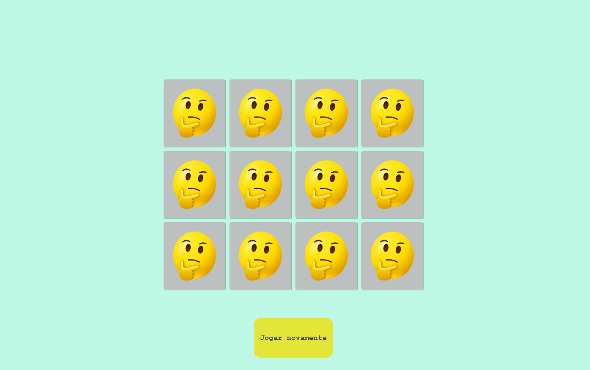

# Jogo da memória 😄😄

 

**Criado em conjunto com a DIO usando funcionalidades do ES6 e CSS3.** 👋👋  
 

 

## Aprendizados  ✅✅
 

* Manipulando eventos em Javascript.
* Fazendo comparações com o atributo data no HTML.
* Aumentando a prática em funções, manipulação de objetos, funções anônimas e 'This' em Js.
* Inserindo novos elementos de forma dinâmica.

 

## Acesso ⬇⬇
 

> [Link para a página aqui](https://jogo-memoria-rust.vercel.app/)

 

## Contato ✉

>Para dúvidas, críticas ou sugestões, me envie um [Email](mailto:brunoornelio@hotmail.com)

